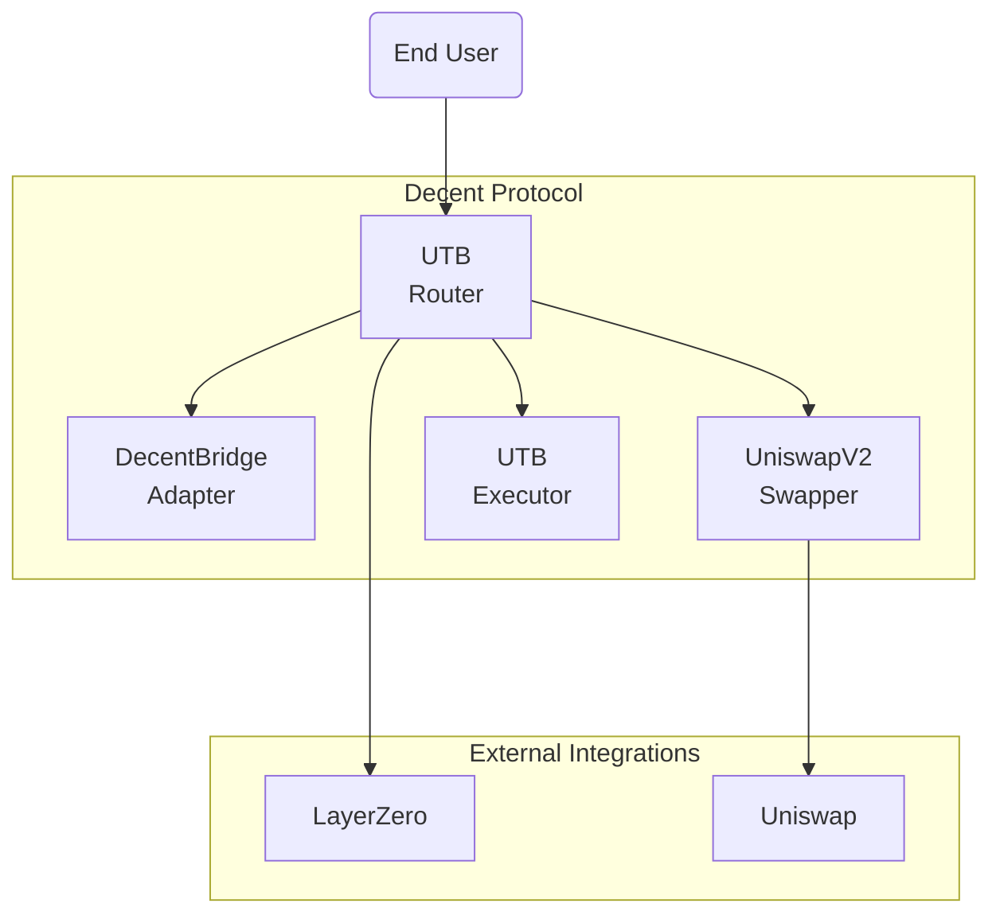
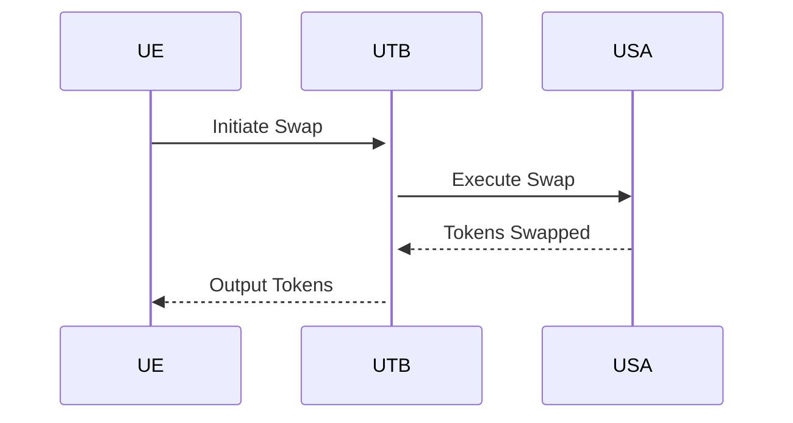

## **Introduction**

Decent facilitates seamless value transfers across different blockchain networks in a secure manner under the hood while providing users a simple one-click interface. 

This report aims to analyze Decent's smart contract architecture powering this cross-chain interoperability, identify risks in the system design and provide recommendations to enhance security and extensibility.

## **Analysis Approach**

The analysis focused on aspects like:

- Reviewing core architecture components and their trust boundaries
- Examining key mechanisms like bridging, swapping protocols  
- Studying access control schemes and roles
- Evaluating integration points with external protocols  
- Manual code review of critical logic contracts
- Automated analysis using Slither and MythX

## **High Level Architecture**



Decent's architecture is modular with clear separation of cross-chain bridging, swapping and transaction execution roles across primary components.

## **Codebase Quality**

### **Readability**

- Clean and consistent styling conventions are followed across most contracts 
- Liberal comments explain intention and logic flow
- Well named functions and variables  

[UTB.sol#bridgeAndExecute](https://github.com/code-423n4/2024-01-decent/blob/07ef78215e3d246d47a410651906287c6acec3ef/src/UTB.sol#L259-L274)

```solidity
/**
* @notice Bridge token and call arbitrary contract on destination chain 
*/
function bridgeAndExecute(
    BridgeInstructions calldata instructions,
    FeeStructure calldata fees,
    bytes calldata signature
)
    public
    payable
    retrieveAndCollectFees(fees, abi.encode(instructions, fees), signature)
    returns (bytes memory)
{
    (
        uint256 amt2Bridge,
        BridgeInstructions memory updatedInstructions
    ) = swapAndModifyPostBridge(instructions);
    return callBridge(amt2Bridge, fees.bridgeFee, updatedInstructions);
}
```

### **Upgradability**

- Business logic components like bridges are not easily upgradeable currently
- Proxy based architecture can enable smooth upgrades

## **Centralization Risks**

**Issue**: Excessive admin control in protocol and lack of social recovery mechanisms

- Owner can unilaterally add/remove swappers 
- Lack of checks on emergency pausing of bridge operations

**Recommendations**:

- Implement DAO based decentralized governance for admin functions
- Require multi-party consensus to invoke emergency functions

## **Systemic Risks** 

**Issue**: Overdependence on availability and security of LayerZero 

- Downtimes or vulnerabilities in LayerZero can break core bridging functions

**Recommendations:**

- Build redundancies with bridge adapter contracts for alternative bridges like Connext, Celer etc.
- Decouple bridge services from application code via well-defined interfaces

## **Swapping Mechanism**



**Analysis**: UniSwap integration introduces risks like front-running and pricing manipulations.

**Recommendations**: 

- Use commit-reveal based schemes
- Build orderbook model instead of direct swaps 

## Analysis of DecentEth for compliance with ERC20 standard to prevent token loss or theft.

**[DecentEth](https://github.com/decentxyz/decent-bridge/blob/7f90fd4489551b69c20d11eeecb17a3f564afb18/src/DcntEth.sol) Inherits OFTV2**

DecentEth inherits from OFTV2 which itself inherits and implements the ERC20 standard so basic functionality like transfers, allowances, balances is compliant.

**Review of Additional Functions**

The main additional functions are:

- `mint` and `burn` - These require the caller to be the router. No issues found.

- `mintByOwner` and `burnByOwner` - As owner only functions, these are compliant with having privileged roles for inflation/deflation.

**Potential Issues**

- There is no `_mint` and `_burn` function which best practice ERC20s provide for overriding protection. **Should consider adding this.**

- DecentEth total supply can reach very high amounts since there are no caps on minting. **Should consider setting a max supply.**

- Allowances are not reset automatically after a transfer. This could cause potential loss of funds if users forget. Can add an `approveAndCall` type function to reset allowance after spend.

**Additional Recommendations** 

- Rename DecentEth.sol to follow standard token naming like DecentToken.sol
- Explicitly mark the router address as immutable rather than a regular state variable
- Follow standard ERC20 interface naming and semantics 

Overall, inheritance from reputable standards like OFTV2 provides good compliance. A few tweaks as suggested above would help prevent loss of funds scenarios.

## Analysis of the fund flows in Decent's contracts

**Delivered or Refunded**

- In [`swapAndExecute`](https://github.com/code-423n4/2024-01-decent/blob/07ef78215e3d246d47a410651906287c6acec3ef/src/UTB.sol#L108-L124), funds either reach the target contract or get refunded via the `refund` address

- Similarly in [`bridgeAndExecute`](https://github.com/code-423n4/2024-01-decent/blob/07ef78215e3d246d47a410651906287c6acec3ef/src/UTB.sol#L259-L274), post-bridge swap and execution refund user if revert

- `UTBExecutor` handles refunds properly on failed executions

- `DecentBridgeExecutor` also has refund logic on transfer/execution failures

So failures and exceptions are handled correctly.

**User Control** 

- For ERC20 tokens, users need to explicitly approve UTB contract before swap or bridge

- For native tokens, value is sent directly so user controls amount

- In `redeemFees` on `UTBFeeCollector`, owner can drain collected fees

So users retain control until they approve transactions. 

**Fee Collection**

- User approves UTB contract to pull UTB fees

- In `retrieveAndCollectFees` modifier, fees move from user -> UTB contract -> `UTBFeeCollector`

- The `collectFees` logic verifies the signature as expected before collecting

So fee collection seems to work correctly, with appropriate controls and flows.

**Recommendations**

- Make tokens added to UTB fee collector drainable by owner rather than only native tokens

- Explicitly mark `feeCollector` address as immutable in `UTB.sol`

## Analysis of the governance controls and risks in Decent's contracts:

**Admin Roles**

- Most contracts use the `Owned` pattern with owner having control

- Owner can add/change swappers, bridges in UTB

- Owner controls fee collector address and fee signer key 

- Can set wrapped native token address

- Can drain funds from fee collector

**Assessment**

- Owner permissions seem standard for most DeFi protocols

- No mechanisms for ownership takeover or multi-sig configurations

- No timelocks on sensitive functionality

So while admin capabilities are high, they are with the accepted centralization tradeoff.

**Potential Attacks**

- If UTB owner key compromised, attackers could:

   - Register malicious bridge and swapper contracts

   - Change fee collector address to their contract

   - Drain collected fees

- Could perform cross-chain fund diversion or sophisticated phishing by manipulating integrated contracts

- No protections against social engineering of admin key holders

**Recommendations** 

- Consider timelocked or multi-sig owner permissions

- Make critical addresses like fee collector immutable

- Add admin event logs for transparency 

## There is a risk of an attacker draining funds from the `UTBFeeCollector` if they were able to compromise the admin key. 

However, the other fund flows through the core protocol contracts are secure:

**UTBFeeCollector**

- The owner of the UTBFeeCollector can drain any fees collected to their account.
- If the owner key was compromised, an attacker could steal these funds.
- No other accumulations happen within the UTBFeeCollector.

**UTB Core Contracts**

- Both native tokens and ERC20 tokens correctly reach their destination or get refunded in case of failures.

- No token balances accumulate in the UTB, Swappers or Bridge Adapters other than approved amounts.

- The executors also handle refunds correctly on reverts.

**Recommendations**

- Use a timelock or multi-sig scheme for draining from the UTBFeeCollector

- Emit events on withdrawals from the fee collector 

So in summary, while the UTBFeeCollector owner powers pose some risk, the core UTB contracts handle funds appropriately. **Adding timelocks would reduce this risk further.**

### Time spent:
15 hours